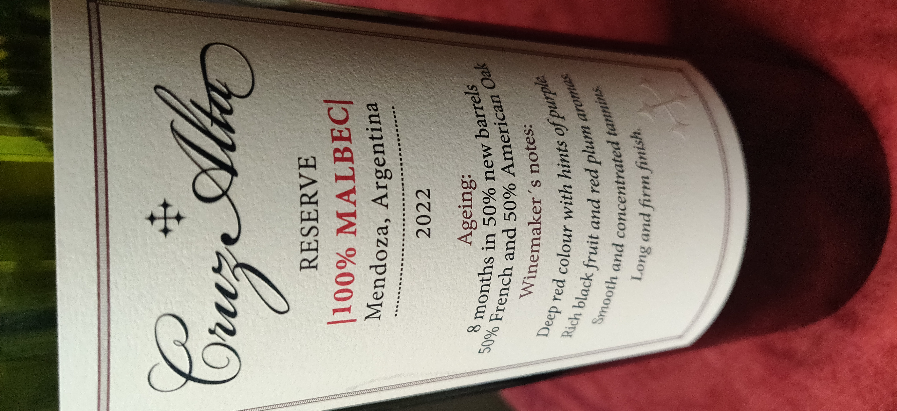
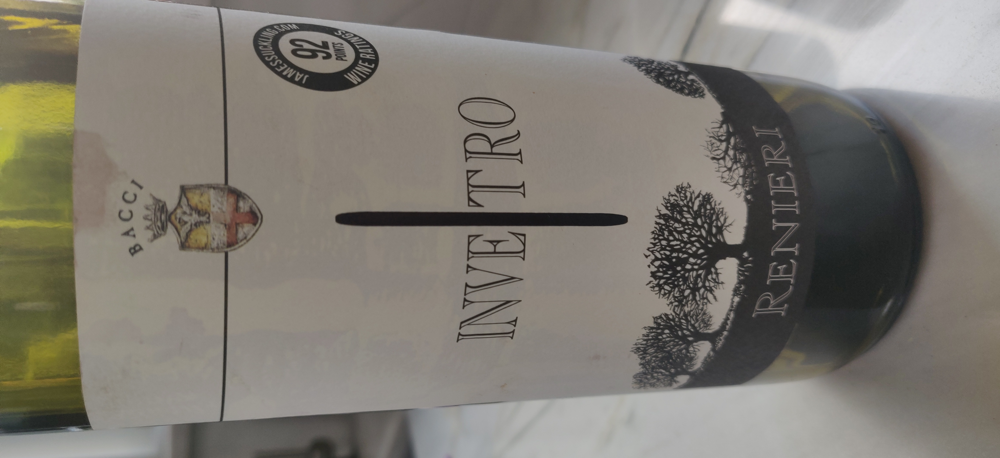
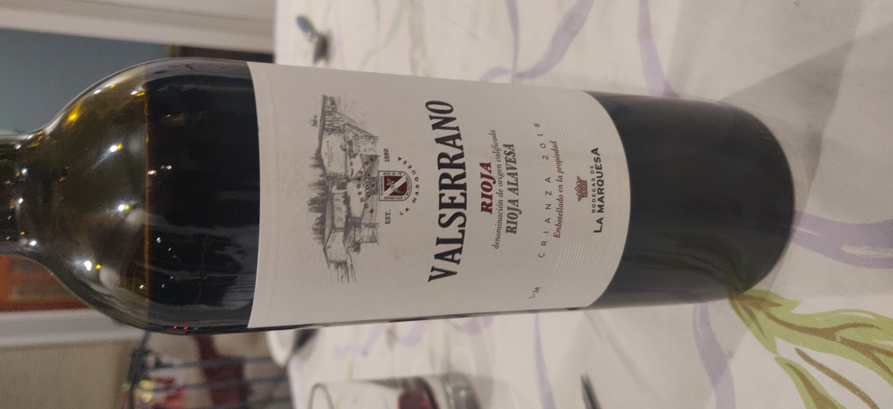

# Introduction

## France

## Argentina

### Malbec

#### Cruze Alta

* Dark fruit blackberry, Structured Tannins not overwhelming.

{ width=200}

## Italy

{ width=200}

## Spain

### Valserrano

{ width=200}

